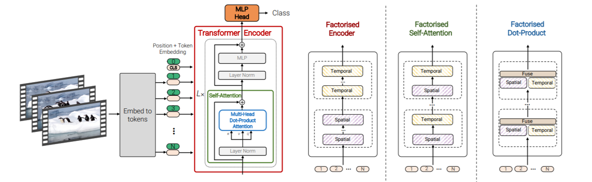
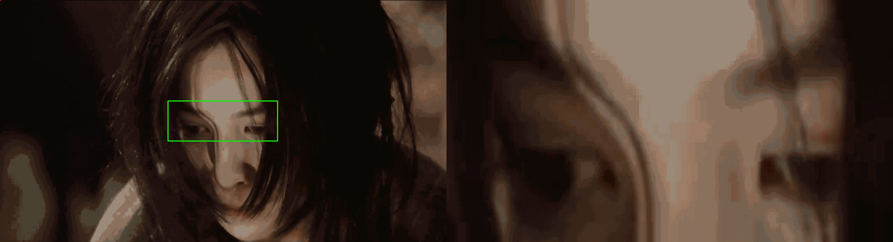
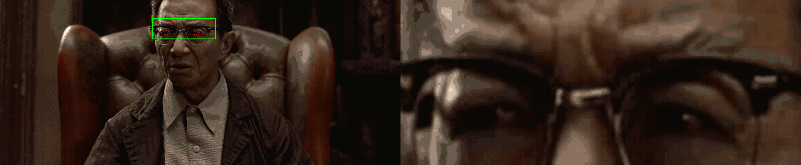
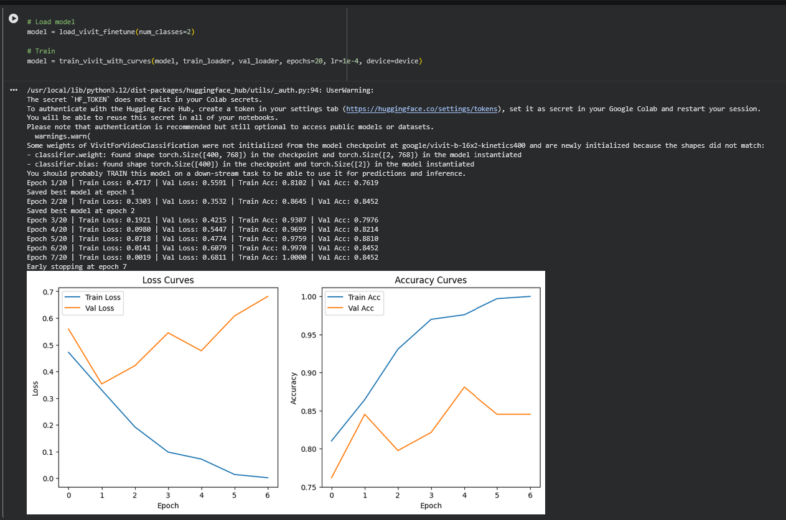
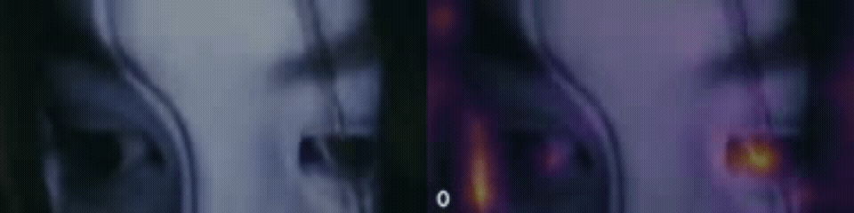
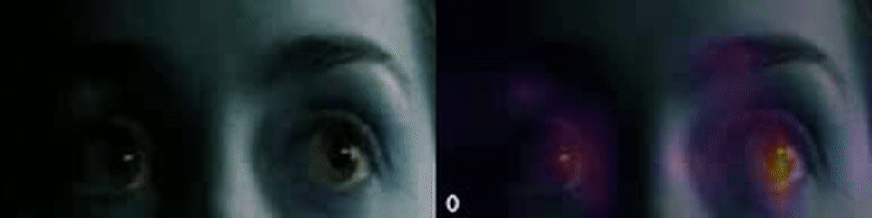
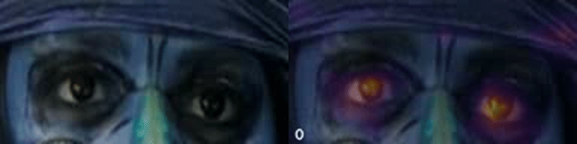
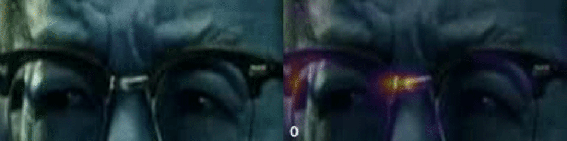
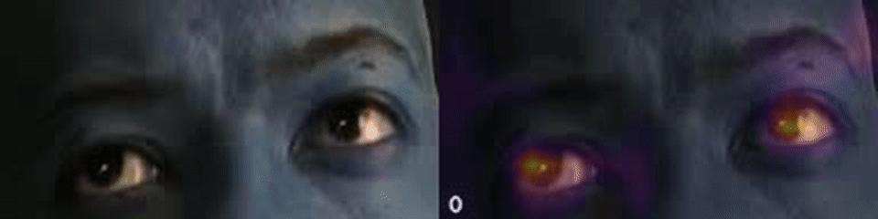

# 👁️ Eye Blink Detection using ViViT  
**Interpretable Spatio-Temporal Modeling with Video Transformers**


> Eye blink detection framed as a **video understanding problem**, solved using **ViViT (Video Vision Transformer)** with **attention-based temporal saliency** for interpretability.

<p align="center">
  
</p>

---

## 🔥 Why This Project?

Eye blinks are:
- ⏱️ **Very short** (few frames)
- 👀 **Subtle** (small eyelid motion)
- 🎥 **Purely temporal**

Traditional approaches (EAR thresholds, frame classifiers) struggle with:
- Head pose changes
- Lighting variations
- Partial occlusion

**Solution:** Learn blink dynamics directly from **video tubelets** using a transformer.

---

## 📊 Dataset


**HUST-LEBW (Large-scale Eye Blink Dataset)**

- Real-world blink videos
- Diverse subjects & lighting
- Frame-accurate blink annotations


**Labels**
- `blink`
- `no_blink`

**Usage in This Project**
- Training ViViT blink classifier
- Evaluation using precision–recall analysis
- Attention-based interpretability experiments

---

## 🎥 Video Preprocessing 

The following examples show **raw input → eye-region extraction → ViViT-ready input**.
Each GIF is a compressed preview; full-quality videos are linked below.

### Blink Samples


<sub>▶ <a href="docs/videos/preprocess/blink_1.mp4">Full video</a></sub>


<sub>▶ <a href="docs/videos/preprocess/blink_2.mp4">Full video</a></sub>


<sub>▶ <a href="docs/videos/preprocess/blink_3.mp4">Full video</a></sub>


<sub>▶ <a href="docs/videos/preprocess/blink_4.mp4">Full video</a></sub>


<sub>▶ <a href="docs/videos/preprocess/blink_5.mp4">Full video</a></sub>

### No-Blink Samples


<sub>▶ <a href="docs/videos/preprocess/no_blink_1.mp4">Full video</a></sub>


<sub>▶ <a href="docs/videos/preprocess/no_blink_2.mp4">Full video</a></sub>


<sub>▶ <a href="docs/videos/preprocess/no_blink_3.mp4">Full video</a></sub>


<sub>▶ <a href="docs/videos/preprocess/no_blink_4.mp4">Full video</a></sub>


<sub>▶ <a href="docs/videos/preprocess/no_blink_5.mp4">Full video</a></sub>


---

## 🧠 Model: ViViT-B/16x2

<table>
  <tr>
    <td align="center">
      
      <br>
      <sub><b>Tubelet Embedding (2-frame patches)</b></sub>
    </td>

    <td align="center">
      
      <br>
      <sub><b>ViViT Feature Extractor</b></sub>
    </td>
  </tr>
</table>

### Key Ideas
- **Tubelet embedding** = 2 consecutive frames
- Joint **spatial + temporal self-attention**
- Pretrained on **Kinetics-400**

### What We Train
- ✔️ Tubelet embeddings  
- ✔️ Last transformer layers  
- ✔️ Classification head  

> Training tubelet embeddings allows the model to learn **micro eyelid motion**, not static appearance.


---

## 🏋️ Training Overview

<p align="center">
  
</p>

- Loss: Cross-Entropy  
- Optimizer: Adam  
- Backbone largely frozen  
- Best checkpoint saved via validation loss  


---

## 🔎 Attention Visualization & Temporal Saliency

**How it works**
- Attention extracted from final ViViT layers
- Aggregated across heads
- Mapped back to temporal tubelets

We visualize **ViViT’s spatio-temporal attention** to interpret blink predictions.
Attention is overlaid on eye-region tubelets.

### 🧭 Spatial Attention — *Where does the model look?*

👉 **Spatial attention maps reveal that the model focuses on:**
- Upper and lower eyelids
- Minimal attention on static background regions

### ⏱️ Temporal Saliency — *When does the blink happen?*

### What the Model Learns

- **Temporal saliency peaks** during eyelid closure frames

---

### Blink Attention Examples


<sub>▶ <a href="docs/videos/attention/blink_1.mp4">Full video</a></sub>


<sub>▶ <a href="docs/videos/attention/blink_2.mp4">Full video</a></sub>


<sub>▶ <a href="docs/videos/attention/blink_3.mp4">Full video</a></sub>


<sub>▶ <a href="docs/videos/attention/blink_4.mp4">Full video</a></sub>


<sub>▶ <a href="docs/videos/attention/blink_5.mp4">Full video</a></sub>


---

### No-Blink Attention Examples


<sub>▶ <a href="docs/videos/attention/no_blink_1.mp4">Full video</a></sub>


<sub>▶ <a href="docs/videos/attention/no_blink_2.mp4">Full video</a></sub>



<sub>▶ <a href="docs/videos/attention/no_blink_3.mp4">Full video</a></sub>


<sub>▶ <a href="docs/videos/attention/no_blink_4.mp4">Full video</a></sub>



<sub>▶ <a href="docs/videos/attention/no_blink_5.mp4">Full video</a></sub>

## 📈 Evaluation

Model performance is evaluated using a **Precision–Recall curve**, which is more appropriate for imbalanced blink detection.


---

## ⚠️ Observed Failure Modes

- Partial eye occlusion
- Very slow or incomplete blinks
- Extreme illumination changes
  
## 🗂️ Project Structure

```
eye-blink-vivit/
├── notebooks/
│ ├── 01_mediapipe_preprocessing.ipynb
│ ├── 02_vivit_training.ipynb
│ ├── 03_attention_visualization.ipynb
│ └── 04_evaluation_metrics.ipynb
│
├── docs/
│ ├── images/
│ │ ├── vivit_architecture.png
│ │ ├── tubelet_embedding.png
│ │ ├── hust_lebw_samples.png
│ │ ├── training_progress.png
│ │ ├── precision_recall_curve.png
│ │ ├── vivit_fe.jpg # <-- Updated extension to .jpg for the ViViT Feature Extractor image
│ │
│ ├── gifs/
│ │ ├── preprocess/
│ │ │ ├── blink_1.gif
│ │ │ ├── blink_2.gif
│ │ │ ├── blink_3.gif
│ │ │ ├── blink_4.gif
│ │ │ └── blink_5.gif
│ │ │
│ │ └── attention/
│ │ ├── blink_1.gif
│ │ ├── blink_2.gif
│ │ ├── blink_3.gif
│ │ ├── blink_4.gif
│ │ └── blink_5.gif
│ │
│ └── videos/
│ ├── preprocess/
│ │ ├── blink_1.mp4
│ │ ├── blink_2.mp4
│ │ ├── blink_3.mp4
│ │ ├── blink_4.mp4
│ │ └── blink_5.mp4
│ │
│ └── attention/
│ ├── blink_1.mp4
│ ├── blink_2.mp4
│ ├── blink_3.mp4
│ ├── blink_4.mp4
│ └── blink_5.mp4
│
├── checkpoints/
│ └── vivit_blink_best.pth
│
├── README.md

```


## 🚀 Key Takeaways

- ✅ ViViT effectively models short-duration blink events  
- ✅ Tubelet embeddings are critical for temporal reasoning  
- ✅ Temporal saliency validates real blink detection  
- ✅ Attention maps provide interpretability  


---

## 🔮 Future Work

- Blink timestamp localization
- Multi-blink temporal segmentation
- Lightweight ViViT variants for real-time inference

---


